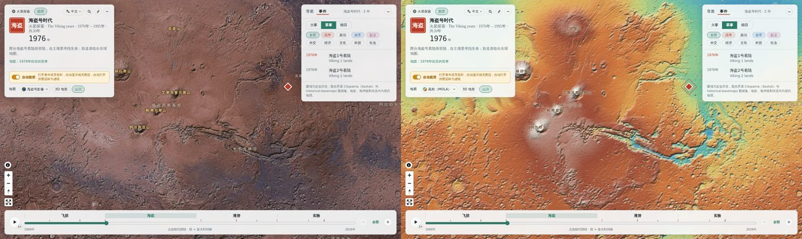

# Your own ground: other planets and invented worlds

By default the atlas draws Earth: elevation, satellite imagery, coastlines, rivers and the world's borders. A
[data pack](custom-data.md) shown alone can swap all of that for its own ground. Mars, the Moon, Middle-earth or a
game world will work, and so will an old map scan laid over Earth. Your periods, events, tours, layers and plugins
work on it the same way as on Earth.



The [Mars pack](../examples/mars-pack/) is a complete example. Open it with
`/?pack=examples/mars-pack/manifest.json&packonly=1`.

## What you need

| Piece | What it gives | Needed? |
| --- | --- | --- |
| **Imagery tiles** | The picture of the ground: a photo mosaic, a painted map, a scan. | One of the two |
| **Elevation tiles** | Relief colours, hill shading and 3D mountains. | One of the two |
| **Place names** | Mountains, plains and seas written on the ground. | Optional |

Coordinates stay longitude and latitude, from −180 to 180 and from −85 to 85. On a real planet, use its own
coordinates; Mars uses east-positive longitudes, so 137.4° E is `137.4` and 47.9° W is `-47.9`. On an invented
world, decide where your map sits on the globe and use the same numbers for your events, places and tours.

## Step 1: make the tiles

The atlas reads tiles in the usual web layout: `{z}/{x}/{y}`, Web Mercator, with row 0 at the north (XYZ).
[`tools/make_tiles.py`](../tools/make_tiles.py) makes them from one picture. It needs Python with numpy and Pillow.

**From one picture of the whole world.** The picture should be plate carrée, or "equirectangular": twice as wide
as it is tall, with longitude running evenly across and latitude evenly down. Most planet maps are made this way.

```sh
python3 tools/make_tiles.py imagery world.jpg my-pack/tiles/img --zoom 4
```

**From a picture of one region.** For example, a fantasy continent drawn as a 4000 × 2400 image. Choose where it
sits on the globe and give its edges as west, south, east, north:

```sh
python3 tools/make_tiles.py imagery continent.png my-pack/tiles/img --zoom 6 --bounds=-20,-12,20,12 --background "#1b2a3a"
```

Keep the area near the equator if you can, because Web Mercator stretches it towards the poles. Choose the bounds
so the picture's width-to-height ratio matches, or it gets stretched.

**Elevation from a grey height map.** Black is the lowest point and white the highest. You give both in metres, and
8-bit and 16-bit PNGs both work:

```sh
python3 tools/make_tiles.py heights heights.png my-pack/tiles/dem --zoom 3 --low -8200 --high 21229
```

This writes [Terrarium](https://github.com/tilezen/joerd/blob/master/docs/formats.md#terrarium) PNGs, which the
atlas reads directly. Heights can be lower resolution than the imagery: zoom 3 or 4 is plenty for 3D.

**Choosing the zoom.** Zoom 4 is 4,096 pixels around the equator, and each step doubles it. A picture W pixels wide
is used fully at zoom log₂(W / 256): 8,192 px gives zoom 5. Past the last zoom the atlas enlarges tiles, so going
higher than your picture only makes the folder bigger. Tile counts grow fourfold per zoom: a whole world to zoom 4
is 341 tiles, and to zoom 6 it is 5,461.

**Tiles you already have.** Any XYZ tile set works as is. If they come from a TMS server, where row 0 is at the
south, renumber them in place first:

```sh
python3 tools/make_tiles.py flip my-pack/tiles/img
```

You know you need this if the map shows horizontal bands that don't line up. That is how the Mars tiles from
OpenPlanetary arrived.

## Step 2: describe the ground in the manifest

Add `basemap` to your pack's `manifest.json`:

```json
"basemap": {
  "earth": false,
  "background": "#0b0b10",
  "imagery": { "tiles": "tiles/img/{z}/{x}/{y}.jpg", "maxzoom": 4, "name": "Viking colour", "name_zh": "海盗号影像" },
  "dem": { "tiles": "tiles/dem/{z}/{x}/{y}.png", "encoding": "terrarium", "maxzoom": 3 },
  "relief": [[-8000, "#1d2a5c"], [0, "#c9d27a"], [5000, "#d0743a"], [21000, "#ffffff"]],
  "reliefName": "Elevation", "reliefName_zh": "高程",
  "exaggeration": 0.5,
  "labels": "labels.json",
  "attribution": "Tiles: your source"
}
```

| Key | Meaning |
| --- | --- |
| `earth` | `false` hides everything that belongs to Earth: coastlines, rivers, lakes, old river courses, Earth's landscape names and the world borders. Leave it out to keep them, for example for an old map scan laid over Earth. |
| `imagery` | Picture tiles. `maxzoom` is the last zoom you made. `name` and `name_zh` label the style in the menu. |
| `dem` | Elevation tiles, for relief, shading and 3D. `encoding` is `terrarium` (default) or `mapbox`. Without `dem` the map is flat and the 3D switch is hidden. |
| `relief` | Colours for heights in metres, as `[height, colour]` pairs, low to high. The relief style uses them. |
| `reliefName`, `reliefName_zh` | The relief style's name in the menu. |
| `background` | Colour around and behind the tiles. |
| `exaggeration` | Multiplies the 3D height (default `1`, which already raises Earth's mountains 2–5×). Use `0.5` or less for a world whose mountains are taller than Earth's. |
| `labels` | Place names file (step 3). |
| `sky` | A [MapLibre sky](https://maplibre.org/maplibre-style-spec/sky/) for the 3D horizon. Default: dark. |
| `attribution` | Credits for the tiles, shown with the map credits. |

Paths are relative to the manifest. The ground only changes with `packonly=1`. Added to the atlas's own history,
a pack keeps Earth.

The style menu (地图 → style) then offers only your styles: the imagery, the relief, or both. Embedders can pick one
with `?style=satellite` (the imagery) or `?style=terrain` (the relief).

## Step 3: name the places

`labels.json` lists names written on the ground. They show with the Landscape (山川) switch:

```json
[
  { "name": "Olympus Mons", "name_zh": "奥林匹斯山", "kind": "mountain", "lon": -133.8, "lat": 18.65 },
  { "name": "Hellas Planitia", "name_zh": "希腊平原", "kind": "plain", "lon": 70.5, "lat": -42.4 },
  { "name": "Gale crater", "name_zh": "盖尔陨坑", "kind": "desert", "lon": 137.8, "lat": -5.4, "minzoom": 4 }
]
```

`kind` sets the style: `mountain`, `plain`, `plateau`, `desert`, `sea`, `lake`, `river` or `corridor`. `minzoom`
hides a name until the map is zoomed in that far.

Towns, roads, rivers and borders of an invented world are [layers](plugins.md#layers): GeoJSON points, lines and
polygons with cards, which can appear and disappear with the years.

## Step 4: try it

Serve the folder locally and open the pack alone:

```sh
python3 -m http.server 8000
# http://localhost:8000/?pack=my-pack/manifest.json&packonly=1
```

Packs on another site must be on the allowlist and need CORS headers (GitHub Pages sends them). See
[Hosting and the allowlist](custom-data.md#hosting-and-the-allowlist).

## When something looks wrong

| You see | Likely cause |
| --- | --- |
| Only the background colour | Wrong `tiles` path. Open one tile's address in the browser to check it. |
| Bands that don't line up, poles swapped | TMS tiles: run `make_tiles.py flip`. |
| Labels and events off the features they name | The picture's bounds or longitude convention differ from your data's. |
| Mountains like needles | Lower `exaggeration`. |
| Blurry close up | Make more zooms, from a bigger picture. |
| Earth's rivers or borders on your world | Add `"earth": false`, and open with `packonly=1`. |
